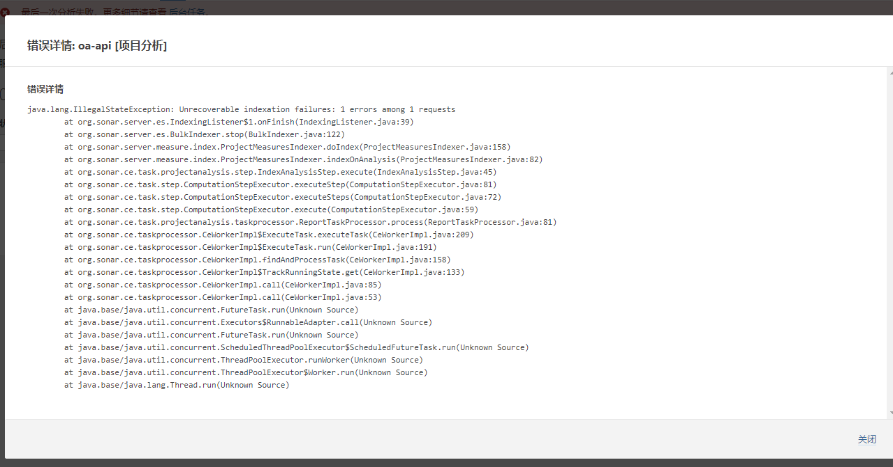

### Sonarqube 搭建使用说明文档

* sonar 支持 postgresql，SQLServer,Oracle，当前使用的是 postgresql

> 中间遇到的问题
* es 报错 

原因是es 启动失败，需要重启 sonarQube 服务

* plugin 下载过慢
> 部分plugin已经下载好，放在目录sonarqube/extensions/plugins 

* 同时需配置以下参数
    > -Dsonar.scm.disabled=true
    
    > -Dsonar.qualitygate.wait=true

Gitlab CI 配置参考

```text
stages:
  - auto-check

代码质量检测:
  stage: auto-check
  image: sonarsource/sonar-scanner-cli:latest
  script:
    - sonar-scanner -Dsonar.qualitygate.wait=true -Dsonar.projectKey=project-api -D"sonar.sources=./src/" -Dsonar.host.url=http://192.168.0.1:9000 -Dsonar.scm.disabled=true
  variables:
    SONAR_TOKEN: '创建项目时生成的Token'
    SONAR_HOST_URL: 'http://192.168.0.1:9000'
    SONAR_USER_HOME: '${CI_PROJECT_DIR}/.sonar'
  cache:
    key: ${CI_JOB_NAME}
    paths:
      - .sonar/cache
  allow_failure: true
  only:
    - 分支名称
```

[官方文档地址](https://docs.sonarqube.org/)