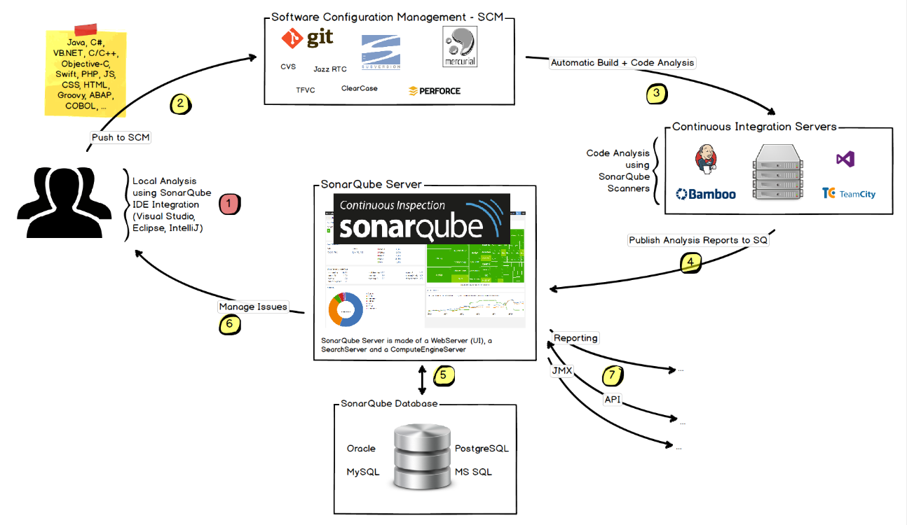
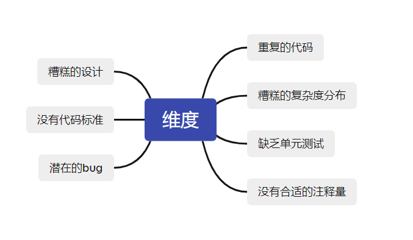
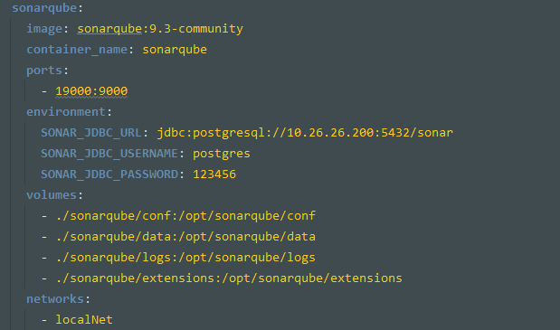
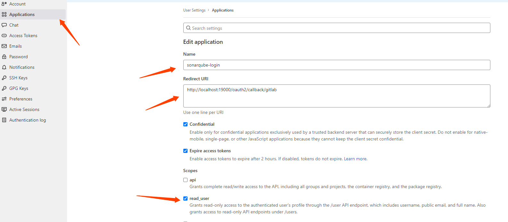
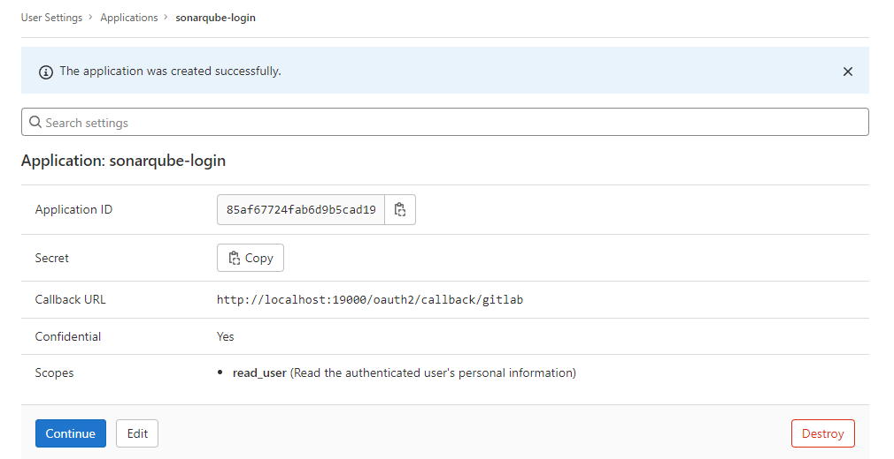
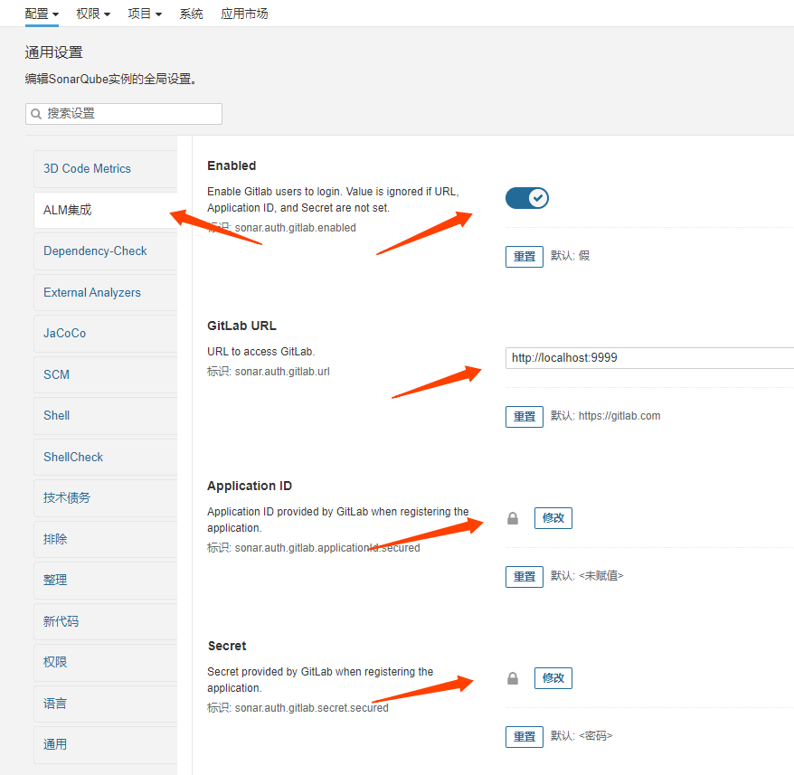
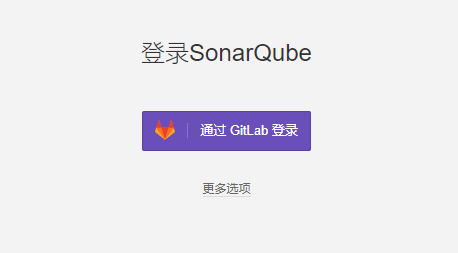
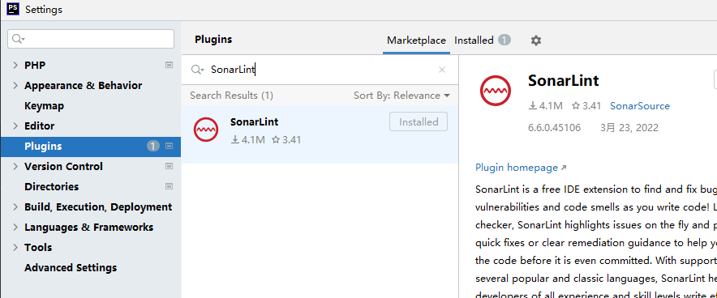
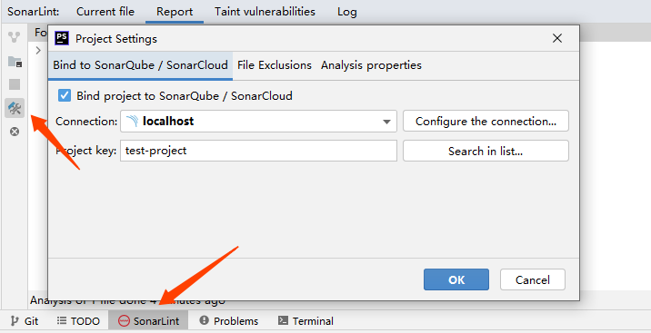

# SonarQube 代码质量检测工具简单使用

-----
- 目录
    - 工具简介
    - 工作原理
    - 检测维度
    - 指标定义
    - 安装SonarQube
    - 插件介绍
    - 项目通用配置、代码规则和质量配置
    - SonarLint 配置本地IDE 配置
    - 检测工具演示 

-----
## 工具简介

SonarQube是一个用于代码质量管理的开源平台，通过插件形式，可以支持多语言的代码质量管理与检测， 主要功能为：

```markdown

代码质量和安全扫描的分析
多维度分析
支持多种编程语言的代码扫描和分析
能够与代码编辑器，CI/CD平台完美集成
帮助开发人员写出更干净，更安全的代码

```
-----
## 工作原理


-----

## 检测维度


-----
## 指标定义（Metric Definitions）

- 可靠性（Reliability）
    - 错误（Bugs）
    - 新错误（New Bugs）
    - 可靠性等级（Reliability Rating）
    - 可靠性修复工作（Reliability remediation effort）
    - 新代码上的可靠性修复工作（Reliability remediation effort on new code）
-----
## 指标定义（Metric Definitions）

```markdown
- 安全性（Security）
    - 漏洞（Vulnerabilities）
    - 新代码的漏洞（Vulnerabilities on new code）
    - 安全等级（Security Rating）
    - 安全修复工作（Security remediation effort ）
    - 新代码的安全修复工作（Security remediation effort on new code）
    - 安全热点（Security Hotspots）
    - 新代码上的安全热点（Security Hotspots on new code）
    - 安全审查评级（Security Review Rating）
    - 新代码的安全审查评级（Security Review Rating on new code）
    - 已审查的安全热点（Security Hotspots Reviewed）
    - 审查了新的安全热点（New Security Hotspots Reviewed）
```
-----
## 指标定义（Metric Definitions）
```markdown
- 可维护性（Maintainability）
    - 异味（Code Smells）
    - 新异味（New Code Smells）
    - 可维护性评级（Maintainability Rating）
    - 技术债务(Technical Debt)
    - 新代码的技术债务(Technical Debt on New Code )
    - 技术负债率(Technical Debt Ratio)
    - 新代码的技术债务比率(Technical Debt Ratio on New Code)
- （大小）Size
    - 类、注释行、目录、文件、代码行数、每种语言的代码行数、函数functions、项目projects、语句statements等
- Tests
    - 条件覆盖、新代码的条件覆盖、条件覆盖命中、行条件、按行覆盖的条件、行覆盖率、单元测试错误、单元测试失败等
- Quality Gates    
    - 质量门状态
    - Quality Gate 详细信息
```
------
## 指标定义（Metric Definitions）
```markdown

- 复杂度（Complexity）
    基于代码的分支计算出来的复杂度，即圈复杂度。当一个方法的控制流多了一个分支，它的复杂度就会增加1。每个方法的最小复杂度为1。

- 重复（Duplication)
    - 重复块、重复文件、重复行

- 问题（Issues)
    - 新问题 New issues：新提交代码中的问题
    - 问题（Issues）：问题总数量。
    - 误报问题（False positive issues）：标记为误报的问题总数
    - 未解决的问题（Open issues）：处于打开状态的问题总数
    - 已确认问题（Confirmed issues）：处于已确认状态的问题总数
    - 重新打开的问题（Reopened issues）：处于重新打开状态的问题总数
```
-----
## 安装SonarQube

docker方式安装步骤，先安装postgresql, 创建数据库sonar，再安装sonarqube



-----
## 安装SonarQube

[其他安装方式可参考官方安装说明文档](https://docs.sonarqube.org/latest/setup/install-server/)

安装中遇到问题：max virtual memory areas vm.max_map_count is too low

解决办法：修改linux的vm.max_map_count，具体命令：sysctl -w vm.max_map_count=524288

[docker-compose方式解决方式](github.com/wowjohn/sonarqube-project/blob/master/docker-compose.yml)

------
## 插件介绍
```text
Administration => Marketplace 选择需要的plugin进行安装

常用plugin:

    sonarqube-community-branch-plugin 代码多分支模式
    sonar-chinese-pack-plugin	      中文语言包
    sonar-javascript-plugin	      JavaScript代码检查
    sonar-web-plugin	              Web页面检查（HTML、JSP、JSF、Ruby、PHP等）
    sonar-scm-stats-plugin	      SCM源码库统计分析
    sonar-timeline-plugin	      时间表显示度量结果
    sonar-motion-chart-plugin	      度量结果演进图
    sonar-checkstyle-plugin	      检查代码编写风格
    sonar-findbugs-plugin	      检查潜在缺陷
    sonar-cobertura-plugin	      统计代码覆盖率
    sonar-jacoco-plugin	              统计代码覆盖率
    sonar-auth-gitlab-plugin          Gitlab SSO

问题：plugin 下载过慢
解决办法：去github(https://github.com/SonarQubeCommunity)或第三方网站将部分plugin下载好，放在目录sonarqube/extensions/plugins下，重启即可 
```

-----
## 项目通用配置、代码规则和质量配置

* 通用：邮件配置、LOGO配置
* 语言配置：要分析的文件的后缀列表，排除项
* 权限： 启用（SAML）
* ALM集成（gitlab sso等）
* 质量阈值配置（Quality Gates）
* 权限和角色配置 (配置 => 权限)
* Gitlab、Jenkins集成

-----
## Gitlab SSO集成



-----
## Gitlab SSO集成



-----
## Gitlab SSO集成



-----

## Gitlab SSO集成

`最终效果`



` 官方文档地址：https://docs.sonarqube.org/latest/analysis/gitlab-integration`

-----
## SonarLint 配置本地IDE 配置

以 PhpStorm 举例 (路径setting => plugins => Marketplace)


-----
## SonarLint 配置本地IDE 配置

连接远程SonarQube，配置对应的token，查看并解决出现的问题


-----
## 检测功能演示
* 本地调用 (PHP)
* Gitlab CI 配置参考
```yml
stages:
  - auto-check

代码质量检测:
  stage: auto-check
  image: sonarsource/sonar-scanner-cli:latest
  script:
    - sonar-scanner -Dsonar.qualitygate.wait=true -Dsonar.projectKey=project-api -D"sonar.sources=./src/" -Dsonar.host.url=http://192.168.0.1:9000 -Dsonar.scm.disabled=true
  variables:
    SONAR_TOKEN: '创建项目时生成的Token'
    SONAR_HOST_URL: 'http://192.168.0.1:9000'
    SONAR_USER_HOME: '${CI_PROJECT_DIR}/.sonar'
  cache:
    key: ${CI_JOB_NAME}
    paths:
      - .sonar/cache
  allow_failure: true
  only:
    - 分支名称
```
* [SonarQube执行参数配置参考](https://docs.sonarqube.org/latest/analysis/analysis-parameters)

-----

## 谢谢大家
